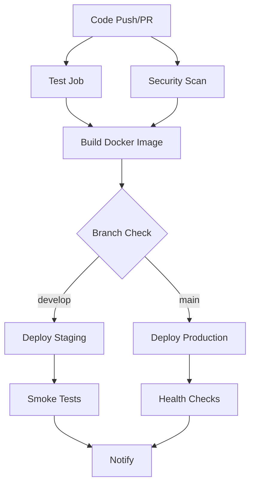

# CI/CD Pipeline Documentation 🚀

This document describes the Continuous Integration and Continuous Deployment (CI/CD) pipeline for the AI Chatbot Code Challenge project.

## 📋 Pipeline Overview

The CI/CD pipeline is built using **GitHub Actions** and includes the following stages:

1. **Test** - Unit tests, integration tests, and code coverage
2. **Security** - Security audits and vulnerability scanning
3. **Build** - Docker image building and pushing to registries
4. **Deploy** - Automated deployment to staging and production
5. **Notify** - Status notifications and reporting

## 🏗️ Pipeline Architecture



## 🧪 Test Stage

### Matrix Testing
- Tests run on Node.js versions: **18.x** and **20.x**
- Uses **pnpm** for package management
- Implements caching for faster builds

### Test Coverage
- Unit tests with Jest
- Integration tests
- Code coverage reporting
- Coverage uploaded to Codecov

### Commands Executed
```bash
pnpm install --frozen-lockfile
pnpm test
pnpm test:coverage
```

## 🔒 Security Stage

### Security Audits
- **pnpm audit** - Package vulnerability scanning
- **npm audit** - Additional security checks
- Continues on errors to not block pipeline

### Vulnerability Management
- Automated dependency updates via Dependabot
- Security policy enforcement
- SBOM (Software Bill of Materials) generation

## 🐳 Build Stage

### Multi-Platform Builds
- **Platforms**: linux/amd64, linux/arm64
- **Base Image**: node:18-alpine
- **Caching**: GitHub Actions cache for layers

### Container Registries
- **GitHub Container Registry** (ghcr.io)
- **Docker Hub** (optional)

### Image Tagging Strategy
```yaml
# Branch-based tags
feature/auth-fix → ghcr.io/repo:feature-auth-fix

# Semantic version tags
v1.2.3 → ghcr.io/repo:1.2.3, ghcr.io/repo:1.2, ghcr.io/repo:1

# Special tags
main → ghcr.io/repo:latest
develop → ghcr.io/repo:develop
```

## 🚀 Deployment Stages

### Staging Deployment
- **Trigger**: Push to `develop` branch
- **Environment**: staging
- **URL**: https://ai-chatbot-staging.example.com
- **Tests**: Smoke tests post-deployment

### Production Deployment
- **Trigger**: Push to `main` branch
- **Environment**: production  
- **URL**: https://ai-chatbot.example.com
- **Tests**: Health checks post-deployment

## ⚙️ Environment Configuration

### Required Secrets

Create these secrets in your GitHub repository:

#### Container Registry
```bash
DOCKERHUB_USERNAME=your-dockerhub-username
DOCKERHUB_TOKEN=your-dockerhub-access-token
```

#### Code Coverage
```bash
CODECOV_TOKEN=your-codecov-token
```

#### Application Secrets
```bash
AUTH_SEED=your-production-jwt-seed
OPENAI_API_KEY=your-openai-api-key  
PINECONE_API_KEY=your-pinecone-api-key
PINECONE_ENVIRONMENT=your-pinecone-environment
PINECONE_INDEX_NAME=your-pinecone-index-name
```

### Environment Variables by Stage

#### Test Environment
- `NODE_ENV=test`
- Mock API keys for testing
- Isolated test database

#### Staging Environment  
- `NODE_ENV=staging`
- Staging API keys
- Staging database connections

#### Production Environment
- `NODE_ENV=production`
- Production API keys
- Production database connections

## 📦 Release Management

### Automated Releases
- **Trigger**: Git tags matching `v*.*.*`
- **Changelog**: Auto-generated from commit messages
- **Artifacts**: Docker images, SBOM files
- **Notifications**: Release announcements

### Release Workflow
```bash
# Create and push a release tag
git tag v1.2.3
git push origin v1.2.3

# This triggers:
# 1. Release creation
# 2. Docker image build
# 3. Multi-platform publishing
# 4. SBOM generation
```

## 🔄 Dependency Management

### Dependabot Configuration
- **Schedule**: Weekly updates on Mondays
- **Scope**: npm, Docker, GitHub Actions
- **Auto-assign**: Project maintainers
- **Labels**: Automated categorization

### Update Strategy
```yaml
npm packages: Weekly security + major updates
Docker images: Weekly base image updates  
GitHub Actions: Weekly action version updates
```

## 📊 Monitoring and Observability

### Pipeline Metrics
- **Build Duration**: Track build performance
- **Success Rate**: Monitor pipeline reliability
- **Test Coverage**: Maintain coverage thresholds
- **Security Scores**: Track vulnerability trends

### Notifications
- **Success**: Deployment confirmations
- **Failure**: Immediate failure alerts
- **Security**: Vulnerability notifications

## 🛠️ Local Development

### Running CI Locally
```bash
# Install act (GitHub Actions local runner)
brew install act  # macOS
# or
curl https://raw.githubusercontent.com/nektos/act/master/install.sh | sudo bash

# Run the CI pipeline locally
act push

# Run specific job
act push -j test
```

### Pre-commit Hooks
```bash
# Install pre-commit
pip install pre-commit

# Setup hooks
pre-commit install

# Run manually
pre-commit run --all-files
```

## 🐛 Troubleshooting

### Common Issues

#### Build Failures
```bash
# Clear GitHub Actions cache
gh api repos/:owner/:repo/actions/caches --method DELETE

# Check Docker build logs
docker buildx build --progress=plain .
```

#### Test Failures
```bash
# Run tests locally with same environment
NODE_ENV=test pnpm test

# Debug specific test
pnpm test -- --verbose --testNamePattern="specific test"
```

#### Deployment Issues
```bash
# Check deployment logs
kubectl logs -l app=ai-chatbot

# Verify environment variables
kubectl get secrets
```

### Debug Commands
```bash
# Check workflow status
gh run list

# View specific run logs  
gh run view <run-id>

# Re-run failed jobs
gh run rerun <run-id>
```

## 📈 Performance Optimization

### Build Speed Improvements
- **Layer Caching**: Docker layer caching enabled
- **Dependency Caching**: pnpm store cached
- **Parallel Jobs**: Matrix strategy for concurrent testing
- **Optimized Images**: Multi-stage Dockerfile

### Resource Management
```yaml
# Recommended resource limits
cpu: 2 cores
memory: 4GB  
disk: 20GB
```

## 🔐 Security Considerations

### Pipeline Security
- **Secret Management**: GitHub Secrets encryption
- **Access Control**: Branch protection rules
- **Audit Logging**: All actions logged
- **Vulnerability Scanning**: Automated security checks

### Best Practices
- Never expose secrets in logs
- Use minimal Docker base images
- Regularly update dependencies
- Implement security scanning

## 📚 Additional Resources

- [GitHub Actions Documentation](https://docs.github.com/en/actions)
- [Docker Best Practices](https://docs.docker.com/develop/dev-best-practices/)
- [Node.js CI/CD Guide](https://nodejs.org/en/docs/guides/nodejs-docker-webapp/)
- [Security Best Practices](https://docs.github.com/en/actions/security-guides)

## 🤝 Contributing to CI/CD

When modifying the pipeline:

1. **Test Locally**: Use `act` to test changes
2. **Document Changes**: Update this documentation
3. **Security Review**: Consider security implications
4. **Rollback Plan**: Ensure changes are reversible
5. **Monitor Impact**: Watch pipeline performance

---

For questions or improvements, please open an issue or contact the maintainers! 🚀