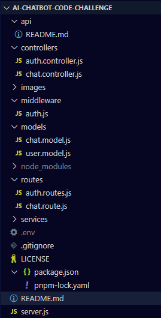

# AI-Powered Chatbot Order Status Service: End-to-End Code Challenge

[AI_Chatbot_Code_Challenge(20250723)](
https://docs.google.com/document/d/1zZCIyEbKMMtyfb0tmi_OF0-P2THC3_Jp_qK894VxS1w/edit?tab=t.0)

>[!IMPORTANT]
>
> ## Problem Description
>
>I am creating a custom chat app to interact with my clients. The chatbot must be polite, maintain focus on delivering an excellent customer experience, and provide accurate, specific information about the chosen product. Each team should select a different product for their chatbot to support (e.g., a SaaS analytics tool, an e-commerce platform, or a fleet-management system).
>
>**The technical details are into this [README.md](api/README.md)**
>
> ## Part 1: User Stories & MVP Definition
>
> 1. As _Stock Market User_ I need to know the last "United States Indices":   `{"username":"Admin","question":"What are the United States Indices?"}`
> 2. As _Stock Market User_ I need to know the last "Most Active Stocks":   `{"username":"Admin","question":"What are the Most Active Stocks?"}`
> 3. As _Stock Market User_ I need to know the last "Top Gainers":   `{"username":"Admin","question":"What are the Top Gainers?"}`
> 4. As _Stock Market User_ I need to know the last "United States Sector Summary"   `{"username":"Admin","question":"What is the list Sector Summary?"}`
>
> The site to do this request and scraping is:
> * <https://www.investing.com/markets/united-states>
>
> ## Part 2: Project Kick-off & Scaffolding
>
>* Project will use [`Node.js/Express`](https://expressjs.com/)
>* This will be the directory layout:   
>* Commit to git using the tree definiction as:
>   * `feature`: This feature branch isolates the new code or changes related to that specific functionality.
>   * `hotfix`: To isolate the fixes from the main (master) development line.
>
> ## Part 3: Authentication & Session Management
>
> Objective: Secure your chatbot with user/password login.
>
> 1. The user creation must be with the API using:   » URL:  `api/auth/register`   » Body: `{"username":"NewName", "password": "abcd1234"}`
> 2. The user login to get the token:   » URL: `api/auth/login`   » Body: `{"username":"NewName", "password": "abcd1234"}`
> 3. The check of validation (Optional):   » URL: `api/chat/can-access`   » Body: `{"username":"NewName"}`   » Header: `x-auth-token=<token>`
> 4. Chat with Chatbot:   » URL: `api/chat`   » Body: `{"username":"NewName","question":"What are the Most Active Stocks?"}`   » Header: `x-auth-token=<token>`
>
> ## Part 4: Building the Core Chat API
>
> Objective: Implement the `/chat` endpoint and integrate with an LLM API
>
> After the user validation with the token, those are the steps:
> 1. **Scraping and text extraction**  For of FINANCE_URLS and fetchAndExtractText()
> 2. **Chunking**  ChunkText();
> 3. **Embeddings of the chunks**   embedChunks();
> 4. **Vectorizing in Pinecone**   upsertEmbeddings();
> 5. **Embedding of the question and search**   embedChunks([q]) and searchSimilarChunks()
>
> ## Part 5: Simulating RAG (Knowledge Base Retrieval)
>
> Objective: Augment replies with product context.
>
> ## Part 6: Automated Testing
>
> Objective: Generate and run unit/integration tests.
>
> ## Part 7: CI/CD Pipeline Setup
>
> Objective: Automate build, test, and deploy.
>
> ## Part 8: Cloud Deployment & Env Configuration
>
> Objective: Deploy your containerized chatbot to the cloud.
>
> ## Bonus Extensions
>
> * Swap JWT for OAuth2 or SSO integration.
> * Implement a front-end chat widget that handles login and chat sessions.
> * Add observability: logs, metrics, and a health check endpoint.
>
> ## Delivery
>
> * **Delivery Date:** August 1 of 2025
> * **Deliverable:** Code repository url, chatbot repository
> * **Deliver to:** <latinamericalearningdevelopment@perficient.com>

