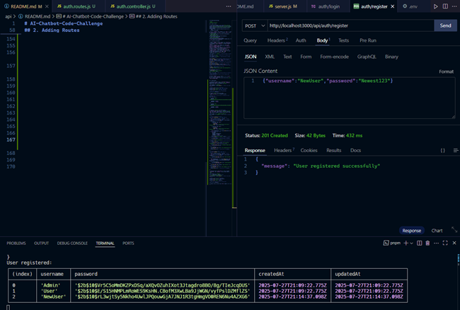
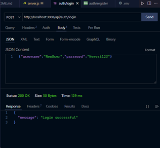
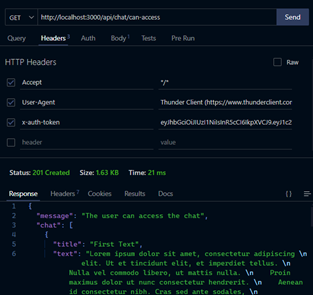
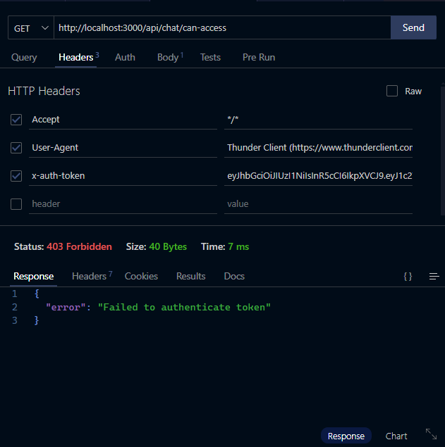
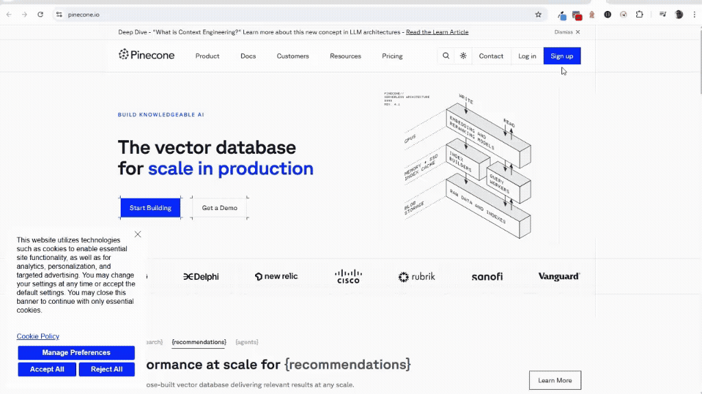

# AI-Chatbot-Code-Challenge

>[!NOTE]
>**Technical details**

## 0. Steps to start

1. Install NPM and NODEJS in your system [Nodejs Download](https://nodejs.org/en/download/current/) or install multiple versions [Instalar múltiples versiones de Node.js en Windows](https://rafaelneto.dev/blog/instalar-multiples-versiones-nodejs-windows/)
2. Check in $path or %path% the nodeJS and npm are on it
  ```bash
  C:/Program Files/nodejs
  ```
3. Run in a `TERMINAL` those commands: </br> `node -v` -> Must be `22.16.0` or up </br> `npm -v` -> Must be `10.9.2` or up.
4. Install Postman
  [Postman Download](https://www.postman.com/downloads/)
5. Install MySQL 5.6.x
  [MySQL Download 5.6.26](https://downloads.mysql.com/archives/community/)
6. Install Visual Studio Code
  [Visual Studio Download](https://code.visualstudio.com/insiders/)
7. Al least access to [`Supabase`](https://supabase.com/), for a `user` table or access permissions.

## 1. Setting the environment

1. Using a `TERMINAL` run this command: </br> `npm init -y`
2. Open the new file **`package.json`**, and do some changes: </br> Instead of `"main": "server.js"` </br> Put `"type": "module",`.
3. Run in a `TERMINAL` this command: </br> `npm install express cors dotenv bcryptjs -E` </br> o </br> `pnpm add express cors dotenv bcryptjs -E`
4. Run in a `TERMINAL` this command, or: </br> `npm install nodemon -E -D` </br> or </br> `pnpm add nodemon -E -D`
5. Create a file in root with name **`server.js`**.
6. In the `"scripts"`, add two new options: </br> `"dev": "nodemon server.js",` </br> `"start": "node server.js"`
7. Create a file in the root with name **`.env`**, at least with the `PORT` definition: </br> `PORT = 3000`
8. Adding some code to **`server.js`** file:
```js
import express from "express"; // Importing express to create the server
import cors from "cors"; // Importing cors to handle Cross-Origin Resource Sharing
import dotenv from "dotenv"; // Importing dotenv to manage environment variables

dotenv.config(); // Load environment variables from .env file
const app = express(); // Create an instance of express
const PORT = process.env.PORT || 3000; // Set the port from environment variables or default to 3000
app.use(cors()); // Use cors middleware to allow cross-origin requests
app.use(express.json()); // Use express.json() middleware to parse JSON request bodies
app.use(express.urlencoded({ extended: true })); // Use express.urlencoded() middleware to parse URL-encoded request bodies
// Define a simple route for the root URL
app.get("/", (req, res) => {
  res.send("Welcome to the AI Chatbot Code Challenge API!");
});
// listen on the specified port
app.listen(PORT, () => {
  console.log(`Server is running on http://localhost:${PORT}`);
});
export default app; // Export the app instance for testing or further configuration
// This is the main entry point for the AI Chatbot Code Challenge API server.
```
9. Using a `TERMINAL` run this command, or: </br> `npm run dev` </br> or </br> `pnpm dev`
10. For a simple test go to any browser and write this _URL_: `http://localhost:3000/`


## 2. Adding Auth Route

1. Starting with create a file **`routes/auth.routes.js`**, importing the `express`, creating the _const_ `authRoutes`, with two mock routes, and the export the _const_:
```js
import express from "express";
const authRoutes = express.Router(); // Create a new router instance

// Define a route for user registration
authRoutes.post("/register", async (req, res)=>{});
// Define a route for user login
authRoutes.post("/login", async (req, res)=>{});

// Export the router to be used in the main app
export default authRoutes;
```
2. Create a _model_ file with this name **`models/user.model.js`**, to emulate the data:
```js
// It will better to use an array or a database for user management.
export const User = [
  {
    username: "Admin",
    password: "$2b$10$Vr5C5oMmDKZPxDSq/aXQvOZuhIXot3Jtagdro8BO/8g/TIeJcqDUS",
    createdAt: new Date(),
    updatedAt: new Date(),
  },
  {
    username: "User",
    password: "$2b$10$E/S15HNMPLmRoWES9KsHN.CBofM3XwLBa9JjWGN/vyfPslDZMflZS",
    createdAt: new Date(),
    updatedAt: new Date(),
  },
];
```
3. Creating a _controller_ file with the name **`controllers/auth.controller.js`**, importing the _model_ `User` and `bcrypt`, then to add two _functions_ with the `POST` process to register a new user, and to log in a user:
```js
import { User } from "../models/user.model.js";
import bcrypt from "bcryptjs"; // Import bcrypt for password hashing

// Function to register a new user
export const registerUser = async (req, res) => {
  try {
    const { username, password } = req.body; // Extract username and password from request body
    const user = await User.find((user) => user.username == username); // Find user by username
    if (!user) {
      if (username.length > 10) {
        return res
          .status(400)
          .json({ error: "Username must be less than 10 characters" }); // Handle username length
      }
      if (password.length > 20) {
        return res
          .status(400)
          .json({ error: "Password must be less than 20 characters" }); // Handle username length
      }
      const hashedPassword = await bcrypt.hash(password, 10); // Hash the password with bcrypt
      const newUser = {
        username,
        password: hashedPassword,
        createdAt: new Date(),
        updatedAt: new Date(),
      }; // Create a new user instance
      console.log("New user created:", newUser); // Log the new user for debugging
      // Save the new user to the User array (or database)
      User.push(newUser); // Add the new user to the User array
      console.log("User registered:"); // Log the new user for debugging
      console.table(User); // Display the User array in a table format
      res.status(201).json({ message: "User registered successfully" }); // Respond with success message
    } else {
      res.status(400).json({ error: "Username already exists" }); // Handle duplicate username
    }
  } catch (error) {
    res.status(500).json({ error: "Error registering user" }); // Handle errors
    console.error(error); // Log the error for debugging
  }
};
// Function to log in a user
export const loginUser = async (req, res) => {
  try {
    const { username, password } = req.body; // Extract username and password from request body
    const user = await User.find((user) => user.username == username); // Find user by username
    if (!user) {
      return res.status(404).json({ error: "User not found" }); // Handle user not found
    }
    const hashedPassword = await bcrypt.hash(password, 10);
    const isPasswordValid = await bcrypt.compare(password, user.password); // Compare provided password with hashed password
    if (!isPasswordValid) {
      return res.status(401).json({ error: "Invalid password" }); // Handle invalid password
    }
    res.status(200).json({ message: "Login successful" }); // Respond with success message
  } catch (error) {
    res.status(500).json({ error: "Error logging in user" }); // Handle errors
    console.error(error); // Log the error for debugging
  }
};
```
4. Then back to the **`auth.routes.js`** file, to import `registerUser`, and `loginUser`, to use in each route as _post_:
```js
import express from "express";
import { registerUser, loginUser } from "../controllers/auth.controller.js";
const authRoutes = express.Router(); // Create a new router instance

// Define a route for user registration
authRoutes.post("/register", registerUser);
// Define a route for user login
authRoutes.post("/login", loginUser);

// Export the router to be used in the main app
export default authRoutes;
```
5. Finally, this is a test of each `POST` request: </br>  </br> 


## 3. Adding Chat Route

1. First we need to get a `jws` _token_, then we will run in a `TERMINAL` this command, or : </br>`npm install jsonwebtoken -E` </br> or </br> `pnpm add jsonwebtoken -E`
2. Add a new value in the **`.env`** file with `AUTH_SEED=` and any mix of numbers and letters next to it.
3. In the **`auth.controller.js`** file, import this new library: </br> `import jwt from "jsonwebtoken";`
4. In the function `loginUser()` , We get the in `jws` format for one hour, to use in the chat request:
```js
    const token = jwt.sign(
      { username: user.username }, // Username as payload
      process.env.AUTH_SEED, // Secret seed from environment variables
      {
        expiresIn: "1h", // Token expiration time
      }
    ); // Generate a JWT token
```
5. Lets go to create a _route_ file with the name **`chat.route.js`**.
6. Same for the _controller_ with the name **`chat.controller.js`**.
7. And a _model_ with the name **`chat.model.js`**, with this basic code:
```js
// It will better to use an array or a database for user management.
export const Chat = [
  {
    title: "First Text",
    text: `Lorem ipsum dolor sit amet, consectetur adipiscing 
    ...`,
    createdAt: new Date(),
    updatedAt: new Date(),
  },
  {
    title: "Second Text",
    text: `Fusce mollis sapien at mi iaculis, sit amet 
    ...`,
    createdAt: new Date(),
    updatedAt: new Date(),
  },
];
```
8. Let's to complete the **`chat.controller.js`**, with this code:
```js
import { User } from "../models/user.model.js";
import { Chat } from "../models/chat.model.js";

// Function to register a new user
export const canAccess = async (req, res) => {
  try {
    const { username, token } = req.body; // Extract username and password from request body
    const user = await User.find((user) => user.username == username); // Find user by username
    if (user) {
      console.log("Testing with middleware:"); // Log the new user for debugging
      res
        .status(201)
        .json({ message: "The user can access the chat", chat: Chat }); // Respond with success message
    } else {
      res.status(400).json({ error: "Username doesn't exists" }); // Handle duplicate username
    }
  } catch (error) {
    res.status(500).json({ error: "Error testing Access" }); // Handle errors
    console.error(error); // Log the error for debugging
  }
};
```
9. Complete the code in **`chat.route.js`** file:
```js
import express from "express";
import { canAccess } from "../controllers/chat.controller.js";

const chatRoutes = express.Router(); // Create a new router instance

// Just check if the user can access the chat
chatRoutes.get("/can-access", canAccess);

// Export the router to be used in the main app
export default chatRoutes;
```
10. Add this route in the **`server.js`** file:
```js
import chatRoutes from "./routes/chat.route.js"; // Importing chat routes
app.use("/api/chat", chatRoutes); // Use the chat routes under the /api/chat
```
11. Create the **`middleware/auth.js`** file, with this code to validate the user keeps token getting by `(POST)auth/login`:
```js
import jwt from "jsonwebtoken"; // Importing jsonwebtoken for token verification

// Middleware to authenticate requests
export const auth = (req, res, next) => {
  // Get the token from the Authorization header
  const token = req.headers["x-auth-token"];
  // If no token, return unauthorized
  if (!token) {
    return res.status(401).json({ error: "No token provided" });
  }

  // Verify the token using the secret seed
  jwt.verify(token, process.env.AUTH_SEED, (err, decoded) => {
    if (err) {
      console.error("Token verification error:", err);
      // If verification fails, return forbidden
      return res.status(403).json({ error: "Failed to authenticate token" });
    }
    req.user = decoded; // Attach the decoded user information to the request object
    next(); // Proceed to the next middleware or route handler
  });
};
```
12. The implementacion is in the **`chat.route.js`** file:
```js
import express from "express";
import { canAccess } from "../controllers/chat.controller.js";
import { auth } from "../middleware/auth.js";

const chatRoutes = express.Router(); // Create a new router instance

// Just check if the user can access the chat
chatRoutes.get("/can-access", [auth], canAccess);

// Export the router to be used in the main app
export default chatRoutes;
```
13. It is the answer when the `token` is valid: </br> 
14. And this is the answer when the `token` has expired: </br> 


## 4. OpenAI and Vector Interaction

1. Using the **`chat.controller.js`** file, let's add a new `post` function point to the _root_ of this _API_:
```js
// Function to interact with OpenAI and `Pinecone` Vector
export const financeChat = async (req, res) => {
  try {
    const { username, question } = req.body; // Extract username and password from request body
    const user = await User.find((user) => user.username == username); // Find user by username
    if (user) {
      // 1. Scraping and text extraction
      // TODO: for of FINANCE_URLS and fetchAndExtractText()
      // 2. Chunking
      // TODO: chunkText();
      // 3. Embeddings of the chunks
      // TODO: embedChunks();
      // 4. Vectorizing in Pinecone
      // TODO: upsertEmbeddings();
      // 5. Embedding of the question and search
      // TODO: embedChunks([q]) and searchSimilarChunks()
      const results = ""; //await searchSimilarChunks(questionEmbedding, 3);
      res.status(200).json({ chat: results }); // Respond with success message
    } else {
      res.status(400).json({ error: "Username doesn't exists" }); // Handle duplicate username
    }
  } catch (error) {
    res.status(500).json({ error: "Error testing Access" }); // Handle errors
    console.error(error); // Log the error for debugging
  }
};
```
2. We need install some libraries or dependencies to `node.js` environment, then in a `TERMINAL` run this command, or </br> `npm install axios openai @pinecone-database/pinecone -E` </br> or </br> `pnpm add axios openai @pinecone-database/pinecone cheerio -E`
3. What is the use of each dependency?
   * [**axios**](https://www.npmjs.com/package/axios):  For HTTP request to externals URLs.
   * [**openai**](https://www.npmjs.com/package/openai): For _embeddings_ generation in the OpenAI _API_.
   * [**@pinecone-database/pinecone**](https://www.npmjs.com/package/@pinecone-database/pinecone): (opcional) For _vector store_, you can use `Pinecone`, `Weaviate`, or `FAISS` (the last one needs `Python`).
   * [**dotenv**](https://www.npmjs.com/package/dotenv): It was installed previosly, it's for _Environment Variables_ manage.
   * [**cheerio**](https://www.npmjs.com/package/cheerio): Cheerio is a fast, flexible, and lean implementation of core jQuery designed specifically for the server-side environment in Node.js. It allows for the parsing of HTML and XML documents and provides an API for traversing and manipulating the resulting data structure, making it a popular choice for web scraping and HTML manipulation tasks.
4. Add to the **`chat.controller.js`** file the Fianacial _URLs_ in a `const`:
```js
// Constants for finance URLs
const FINANCE_URLS = [
  "https://www-google-com.translate.goog/finance/?_x_tr_sl=en&_x_tr_tl=es&_x_tr_hl=es&_x_tr_pto=sge",
  "https://www.tradingview.com/markets/stocks-usa/#news",
  "https://www.investing.com/markets/united-states",
];
```
5. Add in **`chat.route.js`** file, the root using the funcion of the _controller_:
```js
import express from "express";
import { canAccess, financeChat } from "../controllers/chat.controller.js";
import { auth } from "../middleware/auth.js";

const chatRoutes = express.Router(); // Create a new router instance

chatRoutes.get("/can-access", [auth], canAccess); // Route to check user access
chatRoutes.post("/", [auth], fianaceChat); // Route to handle chat requests

// Export the router to be used in the main app
export default chatRoutes;
```
6. Step 1 in `financeChat()` function, Scraping and text extraction, creating the **`services/scraper.js`** file with this code:
```js
import axios from "axios";
import * as cheerio from 'cheerio';

// Extract the main text from the body of a webpage
export async function fetchAndExtractText(url) {
  const { data } = await axios.get(url);
  const $ = cheerio.load(data);
  // You can adjust the selector based on the structure of each page
  return $("body").text().replace(/\s+/g, " ").trim();
}
```
7. Let's use `fetchAndExtractText()` into the **`chat.controller.js`** file:
```js
import { fetchAndExtractText } from "../services/scraper.js";
...
      // 1. Scraping and text extraction
      let allText = "";
      for (const url of FINANCE_URLS) {
        const text = await fetchAndExtractText(url);
        allText += text + "\n";
      }
```
8. Step 2 in `financeChat()` function, Chunking, creating the **`services/scraper.js`** file with this code:
```js
export function chunkText(text, chunkSize = 500) {
  const chunks = [];
  for (let i = 0; i < text.length; i += chunkSize) {
    chunks.push(text.slice(i, i + chunkSize));
  }
  return chunks;
}
```
9. Let's use `chunkText()` into the **`chat.controller.js`** file:
```js
import { chunkText } from "../services/chunker.js"
...
      // 2. Chunking
      const chunks = chunkText(allText, 500);
```
10. Step 3 in `financeChat()` function, Embeddings of the chunks, creating the **`services/embedding.js`** file with this code:
```js
import OpenAI from "openai";
import dotenv from "dotenv"; // Importing dotenv to manage environment variables

dotenv.config(); // Load environment variables from .env file
console.log("OpenAI API Key:", process.env.OPENAI_API_KEY); // Debugging line to check if the API key is loaded correctly
const openai = new OpenAI({ apiKey: process.env.OPENAI_API_KEY });

export async function embedChunks(chunks) {
  const embeddings = [];
  for (const chunk of chunks) {
    const response = await openai.embeddings.create({
      model: "text-embedding-3-small", // "text-embedding-ada-002",
      input: chunk,
      dimensions: 1024, // Reduce dimensions to match Pinecone index
    });
    embeddings.push(response.data[0].embedding);
  }
  return embeddings;
}
```
11. Let's use `embedChunks()` into the **`chat.controller.js`** file:
```js
import { embedChunks } from "../services/embedding.js"
...
      // 3. Embeddings of the chunks
      const embeddings = await embedChunks(chunks);
```
12. For the next steps, it's necessary get a `PINECONE_API_KEY`, then go to the [`Pinecone`](https://www.pinecone.io/), this is the basic process: </br>  </br> **Create as well the `"finance-index"` index.**
13. Step 4 in `financeChat()` function, Vectorizing in Pinecone, creating the **`services/embedding.js`** file with this code:
```js
import { Pinecone } from "@pinecone-database/pinecone";

const pinecone = new Pinecone({ apiKey: process.env.PINECONE_API_KEY });
const index = pinecone.Index("finance-index");

export async function upsertEmbeddings(embeddings, chunks) {
  const vectors = embeddings.map((embedding, i) => ({
    id: `chunk-${i}`,
    values: embedding,
    metadata: { text: chunks[i] },
  }));
  await index.upsert(vectors);
}
```
14. Let's use `upsertEmbeddings()` into the **`chat.controller.js`** file:
```js
import { upsertEmbeddings } from "../services/pineconeClient.js";
...
      // 4. Vectorizing in Pinecone
      await upsertEmbeddings(embeddings, chunks);
```
15. Step 5 in `financeChat()` function, Embedding of the question and search, using the **`services/embedding.js`** file with this code:
```js
export async function searchSimilarChunks(queryEmbedding, topK = 3) {
  const results = await index.query({
    vector: queryEmbedding,
    topK,
    includeMetadata: true,
  });
  return results.matches.map((match) => match.metadata.text);
}
```
16. Let's use `searchSimilarChunks()` into the **`chat.controller.js`** file:
```js
import {
  upsertEmbeddings,
  searchSimilarChunks,
} from "../services/pineconeClient.js";
...
      // 5. Embedding of the question and search
      const [questionEmbedding] = await embedChunks([question]);
      const results = await searchSimilarChunks(questionEmbedding, 3);
```
17. This is the test to the `(POST)api/chat/`: </br> api/chat/")


